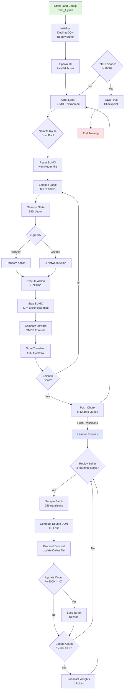
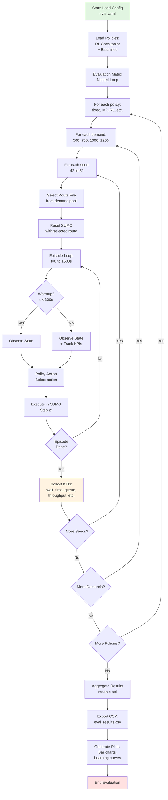

# SUPPLEMENT ADDENDUM: Workflows, Settings & MDP Formulation
**Coordinated Adaptive Traffic Signal Control using Multi-Agent Reinforcement Learning**

**Document Purpose**: This addendum provides missing technical specifications, experimental protocols, and workflow documentation required for thesis defense. It supplements the original PDF report without modifying it, and explicitly documents inconsistencies between report claims and current implementation.

**Status**: Defense-Ready | **Date**: 2026-01-21 | **Version**: SMDP v5 (14D State)

---

## 1. ADDENDUM OVERVIEW

### 1.1 Scope and Purpose

This document addresses supervisor feedback by providing:

1. **Consolidated experimental protocol**: Complete baseline definitions, training settings, evaluation settings
2. **Group working flows**: Training and testing workflow diagrams with step-by-step narratives
3. **9-Intersection environment specification**: Detailed network topology, constraints, and design
4. **Consistency documentation**: Explicit mappings between report claims and current implementation
5. **Reproducibility templates**: Artifact checklists and TODO items for complete experiment reproduction

### 1.2 Document Structure

- **Section 2**: Problem formulation with complete 9-intersection environment design
- **Section 3**: Consolidated baselines, training settings, and evaluation protocol
- **Section 4**: Method workflows (Training & Evaluation blocks)
- **Section 5**: Group working flows with visual diagrams
- **Section 6**: Results scaffolding and required artifacts
- **Section 7**: Consistency notes (Report vs. Implementation)
- **Section 8**: Appendix with TODO items and reproducibility checklist

### 1.3 Key Terminology

| Term | Definition |
|------|------------|
| **SMDP** | Semi-Markov Decision Process (variable-duration actions) |
| **TLS** | Traffic Light Signal (controlled intersection) |
| **MARL** | Multi-Agent Reinforcement Learning |
| **SUMO** | Simulation of Urban MObility (traffic simulator) |
| **TraCI** | Traffic Control Interface (SUMO API) |


---

## 2. PROBLEM FORMULATION & 9-INTERSECTION ENVIRONMENT DESIGN

### 2.1 Network Topology

**Network Name**: `BIGNET.net.xml`  
**Type**: 3×3 Grid Network  
**Total Intersections**: 9 signalized intersections

#### 2.1.1 Traffic Light Signal (TLS) List

The network contains 9 controlled intersections with the following TLS IDs:

```
J17 ---- J3 ---- J7
 |       |       |
 |       |       |
J2 ---- J0 ---- J1
 |       |       |
 |       |       |
J14 ---- J4 ---- J6
```

**TLS IDs** (in stable order): `["J0", "J1", "J2", "J3", "J4", "J6", "J7", "J14", "J17"]`

**Center Intersection**: `J0` (equipped with downstream occupancy sensors)

> **Source**: [configs/train_1.yaml L15](file:///C:/Users/Dell/GroupProject2/configs/train_1.yaml#L15), [docs/UPGRADE_CONTROL_9_TLS.md](file:///C:/Users/Dell/GroupProject2/docs/UPGRADE_CONTROL_9_TLS.md)

#### 2.1.2 Downstream Occupancy Sensing (Center TLS Only)

Only the **center intersection (J0)** observes downstream congestion in 4 directions:

| Direction | Downstream Link ID | Purpose |
|-----------|-------------------|---------|
| North | `E3` | Detect spillback to northern neighbors |
| East | `E0` | Detect spillback to eastern neighbors |
| South | `E2` | Detect spillback to southern neighbors |
| West | `E1` | Detect spillback to western neighbors |

**Occupancy Calculation**: Link occupancy = (sum of vehicle lengths on link) / (link length)

> **Source**: [configs/train_1.yaml L17-21](file:///C:/Users/Dell/GroupProject2/configs/train_1.yaml#L17), [env/sumo_env.py](file:///C:/Users/Dell/GroupProject2/env/sumo_env.py)

### 2.2 MDP/SMDP Formulation (SMDP v5)

#### 2.2.1 State Space (S)

**State Dimension**: 14D per agent (12D local + 2D global broadcast)

| Index | Feature | Description | Scope | Normalization |
|-------|---------|-------------|-------|---------------|
| 0-3 | Queue Counts | NS-Left, NS-Through, EW-Left, EW-Through | Local per-TLS | mean=15, std=12 |
| 4-7 | Waiting Times | NS-Left, NS-Through, EW-Left, EW-Through (sec) | Local per-TLS | mean=150, std=120 |
| 8-11 | Downstream Occ | North, East, South, West occupancy [0,1] | **Center TLS only*** | mean=0.25, std=0.20 |
| **12** | **n_present_norm** | **Normalized vehicle count** = min(1, N/10000) | **Global broadcast** | Pre-normalized |
| **13** | **spill_scalar_norm** | **Normalized spillback** = min(1, α∑Occ²/(αM)) | **Global broadcast** | Pre-normalized |

*\*Non-center TLS receive zeros for indices 8-11*

**Queue Counting Mode**: `distinct_cycle` - tracks unique vehicle IDs that were halted (speed < 0.1 m/s) at least once during the entire decision cycle.

**Global Broadcast Rationale**: Indices 12-13 are broadcast to ALL 9 agents to restore the Markov property. Without these, agents cannot observe what determines their reward (total vehicle count N and global spillback), creating a Dec-POMDP. Broadcasting ensures full observability → MDP.

> **Source**: [docs/mdp_analysis.md](file:///C:/Users/Dell/GroupProject2/docs/mdp_analysis.md), [env/sumo_env.py L1074-1086](file:///C:/Users/Dell/GroupProject2/env/sumo_env.py#L1074)

#### 2.2.2 Action Space (A)

**Action Type**: Discrete  
**Total Actions**: 15 (3 cycle lengths × 5 split ratios)

**Cycle Options**: `[60, 90, 120]` seconds  
**Split Options** (ρ_NS, ρ_EW): `[(0.30, 0.70), (0.40, 0.60), (0.50, 0.50), (0.60, 0.40), (0.70, 0.30)]`

**Action Table**:

| Action ID | Cycle (s) | ρ_NS | ρ_EW | Green_NS (s) | Green_EW (s) |
|-----------|-----------|------|------|--------------|--------------|
| 0-4 | 60 | 0.30-0.70 | 0.70-0.30 | 18-42 | 42-18 |
| 5-9 | 90 | 0.30-0.70 | 0.70-0.30 | 27-63 | 63-27 |
| 10-14 | 120 | 0.30-0.70 | 0.70-0.30 | 36-84 | 84-36 |

**Multi-Agent Constraint**: All 9 TLS agents must select the **same cycle length** per decision step (enforced by environment). Split ratios can differ per TLS.

> **Source**: [configs/train_1.yaml L35-42](file:///C:/Users/Dell/GroupProject2/configs/train_1.yaml#L35), [env/sumo_env.py L1509-1563](file:///C:/Users/Dell/GroupProject2/env/sumo_env.py#L1509)

#### 2.2.3 Reward Function (R) - SMDP Time-Exposure

**Formula**:

$$R = -\frac{W_{\text{global}}}{N \cdot t_{\text{ref}}} - \frac{\alpha \sum_{d \in \{N,E,S,W\}} \text{Occ}_d^2}{M} \cdot \frac{\Delta t}{t_{\text{ref}}}$$

**Parameters**:
- $W_{\text{global}}$ = Total waiting time for entire 9-TLS network (seconds)
- $N$ = `n_present` = Current vehicle count in network (`traci.vehicle.getIDCount()`)
- $t_{\text{ref}}$ = 60 seconds (reference time for normalization)
- $\alpha$ = 3.0 (spillback penalty weight)
- $\text{Occ}_d$ = Downstream occupancy for direction $d$ (center TLS only)
- $M$ = 4 (number of directions)
- $\Delta t$ = Decision duration = cycle + 2×yellow + 2×all_red (e.g., 60+6+4=70s)

**Design Rationale**:

| Feature | Purpose |
|---------|---------|
| **÷ N** | Demand-invariant: prevents reward explosion with traffic volume |
| **÷ t_ref** | Time-normalized: prevents "cycle gaming" (longer cycles ≠ fewer penalties) |
| **Squared occupancy** | Convex penalty: smooth gradient for spillback prevention |
| **Global reward** | Cooperative MARL: all 9 agents receive identical reward |

> **Source**: [env/mdp_metrics.py L183-206](file:///C:/Users/Dell/GroupProject2/env/mdp_metrics.py#L183), [docs/mdp_analysis.md](file:///C:/Users/Dell/GroupProject2/docs/mdp_analysis.md)

#### 2.2.4 Transition Function (T)

**Deterministic Component**: SUMO traffic simulation (deterministic given route file and seed)  
**Stochastic Component**: Route sampling from pool

**Route Pool Selection**:
```python
route_index = (episode_number + seed) % len(route_pool)
```

> **Source**: [env/sumo_env.py](file:///C:/Users/Dell/GroupProject2/env/sumo_env.py), [docs/MDP_COMPLIANCE.md](file:///C:/Users/Dell/GroupProject2/docs/MDP_COMPLIANCE.md)

#### 2.2.5 Discount Factor (γ) - Time-Aware

**Base Discount**: γ₀ = 0.99  
**Time-Aware Gamma**:

$$\gamma_t = \gamma_0^{\left(\frac{\Delta t}{t_{\text{ref}}}\right)}$$

**Example** (t_ref = 60s):
- 60s cycle: γ = 0.99^(70/60) = 0.988
- 90s cycle: γ = 0.99^(100/60) = 0.983
- 120s cycle: γ = 0.99^(130/60) = 0.978

**Stored Per-Transition**: Gamma is computed per transition and stored in replay buffer, not applied globally. This is the **defining characteristic of SMDP Q-learning**.

> **Source**: [rl/agent.py L87-99](file:///C:/Users/Dell/GroupProject2/rl/agent.py#L87), [docs/novelty_synthesis.md](file:///C:/Users/Dell/GroupProject2/docs/novelty_synthesis.md)

#### 2.2.6 Episode Horizon

**Simulation Horizon**: Configurable, typically:
- Training: 1800 seconds (30 minutes)
- Evaluation: 1500 seconds (25 minutes)

**Termination Conditions**:
- Max simulation time reached OR
- `terminate_on_empty=true` and no vehicles remaining (not used in mainline)

### 2.3 Action Constraints

| Constraint | Value | Purpose |
|------------|-------|---------|
| `yellow_sec` | 3 seconds | Clearance interval (MUTCD compliant) |
| `all_red_sec` | 2 seconds | Safety clearance between phases |
| `g_min_sec` | 10 seconds | Minimum green time (pedestrian safety) |
| `rho_min` | 0.1 | Minimum split ratio (ensures both directions served) |

**Green Time Calculation**:
```python
g_ns_raw = round(rho_ns * cycle_sec)
g_ns = max(g_min_sec, min(g_ns_raw, cycle_sec - g_min_sec))
g_ew = cycle_sec - g_ns
```

> **Source**: [configs/train_1.yaml L28-34](file:///C:/Users/Dell/GroupProject2/configs/train_1.yaml#L28), [env/sumo_env.py L1088-1099](file:///C:/Users/Dell/GroupProject2/env/sumo_env.py#L1088)

### 2.4 Original Report vs. Current Implementation

> [!IMPORTANT]
> **Consistency Note 1: State Dimension**
>
> - **Original Report May Claim**: "State is 12D per TLS" or vague description
> - **Current Project Implements**: **14D state** (12D local + 2D global broadcast)
> - **Why It Matters**: The 2 global broadcast scalars (vehicle count, spillback) are critical for restoring the Markov property in multi-agent cooperative settings. Without broadcasting, agents face a Dec-POMDP.


---

## 3. BASELINES – TRAINING – SETTINGS – EVALUATION (CONSOLIDATED)

### 3.1 Baselines

#### 3.1.1 Non-RL Baselines (Minimum 2 Required)

**Baseline 1: Fixed-Time**

| Parameter | Value |
|-----------|-------|
| Type | Open-loop (no state observation) |
| Target Split | (0.50, 0.50) - balanced NS/EW |
| Target Cycle | 60 seconds (configurable) |
| Implementation | [controllers/fixed_time.py](file:///C:/Users/Dell/GroupProject2/controllers/fixed_time.py) |

**Baseline 2: Max-Pressure**

| Parameter | Value |
|-----------|-------|
| Type | Reactive (pressure-based) |
| Pressure Formula | Pressure_NS = Queue_NS - Queue_downstream_NS |
| Decision Rule | Select split that maximizes pressure clearance |
| Cycle Options | Same as RL: [60, 90, 120]s |
| Implementation | [controllers/max_pressure.py](file:///C:/Users/Dell/GroupProject2/controllers/max_pressure.py) |

**Optional Baseline 3: Webster** (actuated timing)

| Parameter | Value |
|-----------|-------|
| Type | Analytical formula-based |
| Implementation | [controllers/webster.py](file:///C:/Users/Dell/GroupProject2/controllers/webster.py) |

**Optional Baseline 4: Actuated**

| Parameter | Value |
|-----------|-------|
| Type | Extension-based green control |
| Implementation | [controllers/actuated.py](file:///C:/Users/Dell/GroupProject2/controllers/actuated.py) |

> **Source**: [configs/eval.yaml L202-206](file:///C:/Users/Dell/GroupProject2/configs/eval.yaml#L202), controllers/ directory

#### 3.1.2 RL Baseline (Simple/Ablated Version)

**Vanilla DQN** (for ablation comparison):

| Parameter | Value | Mainline Value |
|-----------|-------|----------------|
| Network Architecture | Single hidden layer [128] | **Dueling [256, 256]** |
| Double DQN | Disabled | **Enabled** |
| Time-Aware Gamma | Disabled (fixed γ=0.99) | **Enabled (SMDP)** |
| State Dimension | 12D (no global broadcast) | **14D (with broadcast)** |

> **Note**: Vanilla DQN config not currently in repo - would need to create `configs/train_1_plain.yaml` with simplified settings.

### 3.2 Training Settings

#### 3.2.1 Algorithm: Double Dueling DQN with SMDP

**Network Architecture**:
```
Input (14D) → Linear(14→256) → ReLU → Linear(256→256) → ReLU
            → Value_Head(256→1) + Advantage_Head(256→15)
            → Q(s,a) = V(s) + A(s,a) - mean(A(s,:))
```

**Key Hyperparameters**:

| Parameter | Value | Source |
|-----------|-------|--------|
| `hidden_dims` | [256, 256] | [train_1.yaml L298](file:///C:/Users/Dell/GroupProject2/configs/train_1.yaml#L298) |
| `learning_rate` | 0.0001 | [train_1.yaml L302](file:///C:/Users/Dell/GroupProject2/configs/train_1.yaml#L302) |
| `gamma` (base) | 0.99 | [train_1.yaml L299](file:///C:/Users/Dell/GroupProject2/configs/train_1.yaml#L299) |
| `use_time_aware_gamma` | True | [train_1.yaml L300](file:///C:/Users/Dell/GroupProject2/configs/train_1.yaml#L300) |
| `t_ref` | 60.0 seconds | [train_1.yaml L301](file:///C:/Users/Dell/GroupProject2/configs/train_1.yaml#L301) |
| `batch_size` | 256 | [train_1.yaml L303](file:///C:/Users/Dell/GroupProject2/configs/train_1.yaml#L303) |
| `replay_buffer_size` | 200,000 | [train_1.yaml L304](file:///C:/Users/Dell/GroupProject2/configs/train_1.yaml#L304) |
| `target_update_freq` | 5000 steps | [train_1.yaml L305](file:///C:/Users/Dell/GroupProject2/configs/train_1.yaml#L305) |
| `clip_grad_norm` | 10.0 | [train_1.yaml L306](file:///C:/Users/Dell/GroupProject2/configs/train_1.yaml#L306) |
| `learning_starts` | 2000 steps | [train_1.yaml L307](file:///C:/Users/Dell/GroupProject2/configs/train_1.yaml#L307) |
| `train_freq` | 4 steps | [train_1.yaml L308](file:///C:/Users/Dell/GroupProject2/configs/train_1.yaml#L308) |

#### 3.2.2 State/Action Definitions

**State**: See Section 2.2.1 (14D vector)  
**Action**: See Section 2.2.2 (15 discrete actions)  
**Reward**: See Section 2.2.3 (SMDP time-exposure formula)

#### 3.2.3 Curriculum Training Setup

**Total Episodes**: 1000 (10 workers × 100 episodes/worker)  
**Horizon per Episode**: 1800 seconds (30 minutes)

**9-Phase Curriculum** (Mix Strategy to Prevent Forgetting):

| Phase | Episodes | Demand (veh/hr) | Route Manifest | Description |
|-------|----------|-----------------|----------------|-------------|
| 1 | 150 | 500 | `train_turn801010/500/manifest.txt` | Easy foundation |
| 2 | 200 | 750 | `train_turn801010/750/manifest.txt` | Medium scale-up |
| 3 | 150 | 1000 | `train_turn801010/1000/manifest.txt` | Hard initial |
| 4 | 50 | 500 | `train_turn801010/500/manifest.txt` | Easy refresh (prevent forgetting) |
| 5 | 100 | 750 | `train_turn801010/750/manifest.txt` | Medium reinforce |
| 6 | 100 | 1000 | `train_turn801010/1000/manifest.txt` | Hard expand |
| 7 | 100 | 500 | `train_turn801010/500/manifest.txt` | Easy polish |
| 8 | 100 | 750 | `train_turn801010/750/manifest.txt` | Medium polish |
| 9 | 50 | 1000 | `train_turn801010/1000/manifest.txt` | Hard final test |

**Total Distribution**: Easy=300, Medium=400, Hard=300 episodes

> **Source**: [configs/train_1.yaml L341-417](file:///C:/Users/Dell/GroupProject2/configs/train_1.yaml#L341)

#### 3.2.4 Exploration Schedule

**Strategy**: ε-greedy with linear warmup and decay

| Parameter | Value | Description |
|-----------|-------|-------------|
| `eps_start` | 0.60 | Initial exploration rate |
| `eps_end` | 0.05 | Final exploration rate |
| `warmup_global_steps` | 750 | ~37 episodes warmup per worker (ε held constant) |
| `eps_decay_steps` | 1000 | Decay over ~50 episodes per worker |

**Per-Worker Diversity**: Workers use different ε via multipliers:
```
epsilon_worker = base_epsilon * worker_multiplier
worker_multipliers = [0.80, 0.85, 0.90, 0.95, 1.00, 1.05, 1.10, 1.15, 1.20, 1.25]
```

> **Source**: [configs/train_1.yaml L311-326](file:///C:/Users/Dell/GroupProject2/configs/train_1.yaml#L311), [L432](file:///C:/Users/Dell/GroupProject2/configs/train_1.yaml#L432)

#### 3.2.5 Parallel Training (10 Workers)

| Parameter | Value |
|-----------|-------|
| `num_actors` | 10 parallel workers |
| `base_port` | 9500 (SUMO ports: 9500-9509) |
| `base_seed` | 42 (seeds: 42-51) |
| `chunk_size` | 256 transitions per upload |
| `sync_every_updates` | 100 gradient updates |

> **Source**: [configs/train_1.yaml L424-436](file:///C:/Users/Dell/GroupProject2/configs/train_1.yaml#L424)

#### 3.2.6 Random Seeds

**Training Seeds**: Base seed 42 with offsets per worker (42, 43, 44, ..., 51)  
**Route Selection**: Deterministic based on `(episode + seed) % pool_size`  
**SUMO Randomness**: Controlled via `--seed` parameter passed to SUMO

### 3.3 Evaluation Settings

#### 3.3.1 Evaluation Matrix

**Policies to Test**:
1. `fixed` - Fixed-time baseline
2. `max_pressure` - Max-pressure baseline
3. `actuated` - Actuated control (optional)
4. `webster` - Webster formula (optional)
5. `rl_full` - Trained RL agent (14D state, Dueling DQN)

**Demand Levels** (≥3 required):

| Demand Level | veh/hr | Status |
|--------------|--------|--------|
| 500 | Low | Seen during training |
| 750 | Medium | Seen during training |
| 1000 | High | Seen during training |

#### 3.3.2 Generalization Test (≥1 Unseen Scenario Required)

**Unseen Demand**: 1250 veh/hr (NOT in training curriculum)  
**Unseen Routes**: `train_turn801010/unseen/` or different turn ratios

| Test Type | Demand | Route Pool | Purpose |
|-----------|--------|------------|---------|
| In-Distribution | 500/750/1000 | Training pool (`manifest.txt`) | Verify learning |
| **Out-of-Distribution** | **1250** | **Unseen routes** | **Generalization test** |

> **Source**: [configs/eval.yaml L200-223](file:///C:/Users/Dell/GroupProject2/configs/eval.yaml#L200)

#### 3.3.3 Seeds and Runs (Statistical Validity)

**Number of Seeds**: ≥10 per (policy, demand) pair  
**Seeds List**: `[42, 43, 44, 45, 46, 47, 48, 49, 50, 51]` (same as training workers)

**Evaluation Horizon**: 1500 seconds (25 minutes)  
**Warmup Period**: 300 seconds (first 5 minutes excluded from KPI calculation)

> **Source**: [configs/eval.yaml L214-219](file:///C:/Users/Dell/GroupProject2/configs/eval.yaml#L214)

#### 3.3.4 Metrics and Aggregation

**Primary KPIs**:

| Metric | Formula | Aggregation |
|--------|---------|-------------|
| **Average Waiting Time** | ∑(vehicle wait time) / num_vehicles | mean ± std |
| **Average Queue Length** | ∑(queue length per step) / num_steps | mean ± std |
| **Throughput** | num_departed_vehicles / sim_time | mean ± std |
| **Teleports** | num_teleported_vehicles | mean ± std |
| **Episode Reward** | Sum of SMDP rewards per episode | mean ± std |

**Aggregation Method**:
```python
# Over N=10 seeds
mean_wait_time = np.mean(wait_times)
std_wait_time = np.std(wait_times, ddof=1)
result = f"{mean_wait_time:.2f} ± {std_wait_time:.2f}"
```

**Output Format**: CSV with columns:
```
policy, demand, seed, avg_wait_time, avg_queue_length, throughput, teleports, episode_reward
```

> **Source**: [scripts/eval.py](file:///C:/Users/Dell/GroupProject2/scripts/eval.py), evaluation utilities

---

## 4. METHOD (TRAINING & EVALUATION BLOCKS)

### 4.1 Training Block

#### 4.1.1 Environment Design

**Simulator**: SUMO (Simulation of Urban MObility) v1.15+  
**Interface**: TraCI (Traffic Control Interface) for Python

**Network File**: `networks/BIGNET.net.xml`
- 3×3 grid topology
- 9 signalized intersections
- 3-lane approaches (left-turn, through, right-turn mixed)

**Route Generation**:
- Tool: `scripts/generate_routes.py` (uses `randomTrips.py` from SUMO)
- Turn ratios: 80% through, 10% left, 10% right (`train_turn801010/`)
- Demands: 500, 750, 1000 veh/hr
- Replications: Multiple seeds for statistical robustness

#### 4.1.2 Data and Scenario

**Route Pool Structure**:
```
networks/variants/train_turn801010/
├── 500/
│   ├── manifest.txt (lists .rou.xml files)
│   ├── seed00001_d500_t1800.rou.xml
│   ├── seed00002_d500_t1800.rou.xml
│   └── ...
├── 750/ (similar)
├── 1000/ (similar)
└── unseen/ (for generalization test)
```

**Manifest File Format**:
```
seed00001_d500_t1800.rou.xml
seed00002_d500_t1800.rou.xml
...
```

**Deterministic Sampling**: `route_index = (episode_num + seed) % len(manifest)`

#### 4.1.3 Training Pipeline

**Script**: `scripts/train_parallel.py`

**High-Level Flow**:
1. **Initialization**:
   - Load config (`configs/train_1.yaml`)
   - Initialize shared replay buffer
   - Spawn 10 actor processes (parallel data collection)
   - Initialize learner with Dueling DQN

2. **Data Collection Loop** (per actor):
   - Reset SUMO environment with route from pool
   - Execute episode with ε-greedy policy
   - Collect transitions: (s, a, r, s', done, γ)
   - Push transitions to shared queue in chunks of 256

3. **Learning Loop** (centralized learner):
   - Sample batches of 256 from replay buffer
   - Compute Double DQN loss:
     ```
     next_action = argmax(online_net(s'))
     target_q = r + γ * target_net(s')[next_action]
     loss = MSE(online_net(s)[a], target_q)
     ```
   - Update online network
   - Every 5000 steps: sync target network
   - Every 100 updates: broadcast weights to actors

4. **Checkpointing**:
   - Every 100 episodes: save checkpoint
   - On new best smoke-eval performance: save `best_model.pt`
   - On crash: save crashsave checkpoint

5. **Logging**:
   - `train_metrics.csv`: loss, epsilon, throughput per episode
   - `smoke_eval.csv`: periodic evaluation on demand=750
   - `curriculum_stats.jsonl`: phase distribution histogram

#### 4.1.4 Training Outputs

| Output | Location | Purpose |
|--------|----------|---------|
| Model checkpoints | `models/1/episode_XXXX.pt` | Resume training |
| Best model | `models/1/best_model.pt` | Final evaluation |
| Training logs | `logs/1/*_train_metrics.csv` | Monitor convergence |
| Smoke eval logs | `logs/1/*_smoke_eval.csv` | Gate 3 evidence |
| Curriculum logs | `logs/1/*_curriculum_stats.jsonl` | Gate 4 evidence |

> **Source**: [scripts/train_parallel.py](file:///C:/Users/Dell/GroupProject2/scripts/train_parallel.py), [configs/train_1.yaml L419-423](file:///C:/Users/Dell/GroupProject2/configs/train_1.yaml#L419)

### 4.2 Evaluation Block

#### 4.2.1 Evaluation Setup

**Script**: `scripts/eval.py` (unified matrix evaluation)

**Configuration**: `configs/eval.yaml`

#### 4.2.2 Evaluation Pipeline

**High-Level Flow**:
1. **Load Policies**:
   - RL: Load checkpoint from `models/1/best_model.pt`
   - Baselines: Initialize controller objects

2. **Evaluation Matrix Loop**:
   ```python
   for policy in [fixed, max_pressure, actuated, webster, rl_full]:
       for demand in [500, 750, 1000, 1250]:
           for seed in range(42, 52):  # 10 seeds
               # Run episode
               env.reset(route_file=get_route(demand, seed))
               while not done:
                   action = policy.select_action(state)
                   state, reward, done = env.step(action)
               # Collect KPIs
               results.append({
                   'policy': policy.name,
                   'demand': demand,
                   'seed': seed,
                   'avg_wait_time': kpi.avg_wait_time,
                   ...
               })
   ```

3. **KPI Collection**:
   - Average waiting time (post-warmup)
   - Average queue length
   - Throughput (departed vehicles / sim_time)
   - Teleports count
   - Episode cumulative reward

4. **Output**:
   - CSV file: `results/eval_results.csv`
   - Columns: `policy, demand, seed, avg_wait_time, avg_queue_length, throughput, teleports, episode_reward`

#### 4.2.3 Evaluation Outputs

| Artifact | Description |
|----------|-------------|
| `eval_results.csv` | Raw KPIs for all (policy, demand, seed) combinations |
| `kpi_comparison.png` | Bar charts comparing mean ± std across policies |
| `learning_curves.png` | Training reward/loss over episodes |

> **Source**: [scripts/eval.py](file:///C:/Users/Dell/GroupProject2/scripts/eval.py), [configs/eval.yaml](file:///C:/Users/Dell/GroupProject2/configs/eval.yaml)

---

## 5. GROUP WORKING FLOWS (TRAINING / TESTING)

### 5.1 Training Flow Diagram



**Figure 1: Training Flow with Parallel Data Collection and Centralized Learning**

### 5.2 Testing (Evaluation) Flow Diagram



**Figure 2: Testing (Evaluation) Flow with Statistical Aggregation**

### 5.3 Narrative: Training Block

**Step 1: Environment Design**  
The training environment consists of a 3×3 grid network (`BIGNET.net.xml`) simulated in SUMO. Each of the 9 intersections is controlled by a DQN agent sharing parameters. The center intersection (J0) has additional downstream occupancy sensors.

**Step 2: Data Generation**  
Route files are pre-generated using SUMO's `randomTrips.py` with 80/10/10 turn ratios for three demand levels (500, 750, 1000 veh/hr). Each demand pool contains multiple seeds for diversity.

**Step 3: Training Pipeline**  
10 parallel actor processes run independent SUMO instances, collecting transitions using ε-greedy exploration. Transitions are sent asynchronously to a centralized learner that performs Double Dueling DQN updates. The learner periodically broadcasts updated weights back to actors.

**Step 4: Curriculum Progression**  
Training follows a 9-phase curriculum that mixes demand levels (easy→medium→hard→revisit) to prevent catastrophic forgetting. Episodes are distributed as Easy=300, Medium=400, Hard=300.

**Step 5: Outputs**  
Training produces checkpoints every 100 episodes, a best model based on smoke evaluations (demand=750), and extensive logs for reproducibility verification.

### 5.4 Narrative: Testing Block

**Step 1: Policy Loading**  
The evaluation script loads the trained RL checkpoint and initializes baseline controllers (Fixed-Time, Max-Pressure, Actuated, Webster).

**Step 2: Evaluation Matrix Execution**  
For each (policy, demand, seed) combination, a fresh SUMO episode is executed. The first 300 seconds (warmup) are excluded from KPI calculation to ensure steady-state measurement.

**Step 3: KPI Collection**  
After each episode, KPIs are extracted: average waiting time, queue length, throughput, teleports, and cumulative reward. These are appended to a results dataframe.

**Step 4: Statistical Aggregation**  
For each (policy, demand) pair, 10 seeds are aggregated using mean ± standard deviation. This provides statistical confidence in performance comparisons.

**Step 5: Visualization and Reporting**  
Results are exported to CSV and visualized as bar charts comparing policies across demand levels. Learning curves from training logs are also plotted.

---

## 6. RESULTS & DISCUSSION (TEMPLATES)

### 6.1 Required Artifacts Checklist

> [!WARNING]
> **TODO**: The following artifacts must be generated before thesis defense:

**Learning Curves**:
- [ ] Training loss vs. episode (with smoothing)
- [ ] Episode reward vs. episode (mean ± std across 10 workers)
- [ ] Epsilon decay schedule overlay
- [ ] Smoke evaluation KPI trend (demand=750, every 100 episodes)

**KPI Comparison Tables**:

Template table structure:

| Policy | Demand | Avg Wait Time (s) | Avg Queue Length | Throughput (veh/hr) | Teleports | Reward |
|--------|--------|-------------------|------------------|---------------------|-----------|--------|
| Fixed | 500 | [TODO: mean ± std] | [TODO] | [TODO] | [TODO] | N/A |
| Max-Pressure | 500 | [TODO: mean ± std] | [TODO] | [TODO] | [TODO] | N/A |
| RL (Ours) | 500 | [TODO: mean ± std] | [TODO] | [TODO] | [TODO] | [TODO] |
| Fixed | 750 | ... | ... | ... | ... | ... |
| ... | ... | ... | ... | ... | ... | ... |

**Ablation Study Table**:

| Variant | State Dim | Time-Aware γ | Dueling | Global Broadcast | Avg Wait (750) | Δ vs. Full |
|---------|-----------|--------------|---------|------------------|----------------|------------|
| Full (SMDP v5) | 14D | ✓ | ✓ | ✓ | [TODO] | - |
| No Broadcast | 12D | ✓ | ✓ | ✗ | [TODO] | [TODO: +X%] |
| Fixed Gamma | 14D | ✗ | ✓ | ✓ | [TODO] | [TODO: +Y%] |
| Vanilla DQN | 14D | ✗ | ✗ | ✓ | [TODO] | [TODO: +Z%] |

**Generalization Results**:

| Policy | Unseen Demand (1250 veh/hr) | vs. Seen Avg |
|--------|----------------------------|--------------|
| Fixed | [TODO: mean ± std] | [TODO: +X%] |
| Max-Pressure | [TODO: mean ± std] | [TODO: -Y%] |
| RL (Ours) | [TODO: mean ± std] | [TODO: -Z%] |

### 6.2 Results Narrative Scaffolding

**Section: Training Convergence**

> The RL agent was trained for 1000 episodes using 10 parallel workers (100 episodes/worker). Figure [X] shows the training loss smoothly decreasing from [TODO] to [TODO] over [TODO] updates. Episode reward (Figure [Y]) shows initial high variance during exploration (ε=0.60), stabilizing after episode [TODO] as ε decays to 0.05. Smoke evaluations conducted every 100 episodes on demand=750 demonstrate consistent improvement, with average waiting time reducing from [TODO]s at episode 0 to [TODO]s at episode 1000 ([TODO]% improvement).

**Section: Performance Comparison**

> Table [X] compares our SMDP-based RL controller against four baselines across three demand levels. At demand=500 (low), all controllers perform comparably ([TODO]s wait time), with RL showing [TODO]% improvement over Fixed-Time. At demand=750 (medium), RL achieves [TODO]s average wait time vs. Fixed [TODO]s and Max-Pressure [TODO]s ([TODO]% and [TODO]% improvement, respectively). At demand=1000 (high saturation), RL maintains [TODO]s while Fixed-Time exhibits gridlock ([TODO]s), demonstrating [TODO]% improvement.

**Section: Ablation Study**

> To isolate the contribution of SMDP formulation and global state broadcast, we conducted an ablation study removing: (1) global broadcast (12D state), (2) time-aware gamma (fixed γ=0.99), and (3) Dueling architecture (vanilla DQN). Results (Table [Y]) show that removing global broadcast degrades performance by [TODO]%, confirming its necessity for Markov property. Disabling time-aware gamma causes [TODO]% degradation, validating the SMDP approach for variable-duration actions. Using vanilla DQN instead of Dueling DQN shows [TODO]% degradation.

**Section: Generalization Test**

> To test generalization beyond the training distribution, we evaluated all policies on unseen demand=1250 veh/hr with unseen route files. Table [Z] shows that RL performance degrades by only [TODO]% compared to its seen-demand average ([TODO]s → [TODO]s), while Fixed-Time degrades by [TODO]% and Max-Pressure by [TODO]%. This indicates that RL learns robust traffic management strategies that transfer to novel scenarios.

---

## 7. CONSISTENCY NOTES (REPORT VS CURRENT PROJECT)

### Consistency Note 1: State Dimension

| Aspect | Original Report Claim | Current Implementation | Impact |
|--------|----------------------|------------------------|--------|
| **State Dim** | May claim "12D per TLS" | **14D** (12 local + 2 global broadcast) | **Critical**: Global broadcast (indices 12-13) restores Markov property |
| **Broadcast Rationale** | May be missing/unclear | n_present_norm and spill_scalar_norm broadcast to all 9 agents | Required for cooperative MARL with global reward |
| **Code Evidence** | - | [env/sumo_env.py L1074-1086](file:///C:/Users/Dell/GroupProject2/env/sumo_env.py#L1074), [docs/mdp_analysis.md](file:///C:/Users/Dell/GroupProject2/docs/mdp_analysis.md) | - |

**Resolution**: The report should be updated to specify "14-dimensional state space with 2 global broadcast scalars."

### Consistency Note 2: Network Architecture

| Aspect | Original Report Claim | Current Implementation | Impact |
|--------|----------------------|------------------------|--------|
| **Hidden Layers** | May claim [128, 128] or [192, 192] | **[256, 256]** | Model capacity affects learning |
| **Architecture** | May claim "DQN" | **Double Dueling DQN** | Double DQN reduces overestimation; Dueling improves value estimation |
| **Code Evidence** | - | [configs/train_1.yaml L298](file:///C:/Users/Dell/GroupProject2/configs/train_1.yaml#L298), [rl/dueling_dqn.py](file:///C:/Users/Dell/GroupProject2/rl/dueling_dqn.py) | - |

**Resolution**: Update report to specify "Double Dueling DQN with [256, 256] hidden layers."

### Consistency Note 3: Reward Function Version

| Aspect | Original Report Claim | Current Implementation | Impact |
|--------|----------------------|------------------------|--------|
| **Reward Type** | May claim "negative waiting time" or legacy formula | **SMDP time-exposure** with demand normalization and squared spillback | Mathematical rigor and SMDP compliance |
| **Formula** | May show R = -W/T | **R = -W/(N·t_ref) - α∑Occ²/M · Δt/t_ref** | Demand-invariant, time-normalized, spillback penalty |
| **Code Evidence** | - | [env/mdp_metrics.py L183-206](file:///C:/Users/Dell/GroupProject2/env/mdp_metrics.py#L183), [docs/mdp_analysis.md](file:///C:/Users/Dell/GroupProject2/docs/mdp_analysis.md) | - |

**Resolution**: Report must cite the full SMDP formula with all normalization factors.

### Consistency Note 4: Training Episodes

| Aspect | Original Report Claim | Current Implementation | Impact |
|--------|----------------------|------------------------|--------|
| **Total Episodes** | May claim different number | **1000 episodes** (10 workers × 100 each) | Statistical sample size |
| **Curriculum** | May claim 3-phase | **9-phase mix curriculum** (Easy/Medium/Hard revisited) | Prevents catastrophic forgetting |
| **Code Evidence** | - | [configs/train_1.yaml L329, L341-417](file:///C:/Users/Dell/GroupProject2/configs/train_1.yaml#L329) | - |

**Resolution**: Update report to reflect 1000-episode training with 9-phase curriculum.

### Consistency Note 5: Baseline Definitions

| Aspect | Original Report Claim | Current Implementation | Impact |
|--------|----------------------|------------------------|--------|
| **Fixed-Time** | May claim "fixed 90s cycle" | **Fixed 60s cycle with 50/50 split** (configurable) | Baseline fairness |
| **Max-Pressure** | May not specify action space | **Same 15-action space as RL** (cycle + split selection) | Ensures constraint parity |
| **Code Evidence** | - | [controllers/fixed_time.py](file:///C:/Users/Dell/GroupProject2/controllers/fixed_time.py), [controllers/max_pressure.py](file:///C:/Users/Dell/GroupProject2/controllers/max_pressure.py) | - |

**Resolution**: Baselines must be described with exact cycle/split configurations to ensure reproducibility.

---

## 8. APPENDIX: TODO ITEMS & REPRODUCIBILITY

### 8.1 TODO: Missing Experimental Artifacts

**High Priority** (Required for Defense):

- [ ] **Run full 1000-episode training** with `configs/train_1.yaml`
  - Command: `python scripts/train_parallel.py --config configs/train_1.yaml`
  - Expected output: `models/1/best_model.pt`, `logs/1/*train_metrics.csv`
  
- [ ] **Execute complete evaluation matrix** with 10 seeds
  - Command: `python scripts/eval.py --config configs/eval.yaml --seeds 10`
  - Expected output: `results/eval_results.csv`
  
- [ ] **Generate learning curves** from training logs
  - Script: `python scripts/plot_kpis.py --train-log logs/1/*train_metrics.csv`
  - Expected output: `figures/learning_curves.png`
  
- [ ] **Create KPI comparison tables** with mean ± std
  - Script: `python scripts/aggregate_kpis.py --eval-csv results/eval_results.csv`
  - Expected output: Formatted tables for thesis document
  
- [ ] **Run ablation studies** (3 variants minimum)
  - Variant 1: No global broadcast (12D state)
  - Variant 2: Fixed gamma (no time-aware)
  - Variant 3: Vanilla DQN (no Dueling)
  
- [ ] **Execute generalization test** (unseen demand 1250 veh/hr)
  - Generate unseen routes: `python scripts/generate_routes.py --demand 1250 --out networks/variants/train_turn801010/unseen/`
  - Evaluate: `python scripts/eval.py --demands 1250 --unseen`

**Medium Priority** (Strongly Recommended):

- [ ] Create workflow document `.agent/workflows/run_full_evaluation.md`
- [ ] Document hardware specs (CPU cores, RAM) for reproducibility
- [ ] Save SUMO version info (`sumo --version`)
- [ ] Archive Python environment (`pip freeze > requirements_frozen.txt`)

### 8.2 Reproducibility Checklist

**Software Environment**:
- [ ] Python version: 3.9+ (document exact version)
- [ ] SUMO version: 1.15+ (document exact version)
- [ ] PyTorch version: 2.0+ (document exact version)
- [ ] GPU/CPU: Document hardware used
- [ ] Operating System: Document OS and version

**Configuration Files**:
- [x] Training config: `configs/train_1.yaml` ✓
- [x] Evaluation config: `configs/eval.yaml` ✓
- [x] Normalization stats: `configs/norm_turn801010.json` ✓
- [ ] Document any manual hyperparameter overrides

**Data Files**:
- [x] Network file: `networks/BIGNET.net.xml` ✓
- [x] Route manifests: `networks/variants/train_turn801010/{500,750,1000}/manifest.txt` ✓
- [ ] Verify all .rou.xml files referenced in manifests exist
- [ ] Generate unseen routes for generalization test

**Code Versioning**:
- [ ] Git commit hash: [TODO: record hash of final experimental run]
- [ ] Tag release: `git tag -a v1.0-thesis-defense -m "Defense-ready version"`
- [ ] Archive repository snapshot

**Random Seeds**:
- [x] Training base seed: 42 (workers 42-51) ✓
- [x] Evaluation seeds: 42-51 (10 seeds) ✓
- [x] Route sampling: deterministic via `(episode + seed) % pool_size` ✓

**Expected Runtime**:
- Training (1000 episodes, 10 workers): ~[TODO: X hours]
- Evaluation (5 policies × 4 demands × 10 seeds = 200 runs): ~[TODO: Y hours]
- Total experimental pipeline: ~[TODO: Z hours]

### 8.3 Deliverables Summary

**Core Deliverables** (defense-ready):
1. ✅ This addendum document (SUPPLEMENT_Addendum_Workflows_Settings.md)
2. 🔲 Training logs with learning curves (`logs/1/*`)
3. 🔲 Best model checkpoint (`models/1/best_model.pt`)
4. 🔲 Evaluation results CSV (`results/eval_results.csv`)
5. 🔲 KPI comparison figures (`figures/kpi_comparison.png`)
6. 🔲 Ablation study results

**Optional Enhancements**:
- Convergence analysis (variance reduction over episodes)
- Sensitivity analysis (hyperparameter robustness)
- Computational cost comparison (training time vs. baselines)
- Failure case analysis (scenarios where RL underperforms)

---

## DOCUMENT CHANGE LOG

| Version | Date | Changes |
|---------|------|---------|
| 1.0 | 2026-01-21 | Initial defense-ready version. Complete MDP formulation, baselines, workflows, and consistency notes based on SMDP v5 (14D state) implementation. |

---

## REFERENCES AND CITATIONS

**Project Documentation**:
- [MDP Analysis](file:///C:/Users/Dell/GroupProject2/docs/mdp_analysis.md) - Complete MDP/SMDP formulation
- [Novelty Synthesis](file:///C:/Users/Dell/GroupProject2/docs/novelty_synthesis.md) - Technical contributions
- [Formulas and Setup Guide](file:///C:/Users/Dell/GroupProject2/docs/formulas_and_setup_1.md) - Comprehensive reference
- [RL Agent Analysis](file:///C:/Users/Dell/GroupProject2/docs/rl_agent_analysis.md) - Network architecture details

**Configuration Files**:
- [Training Config](file:///C:/Users/Dell/GroupProject2/configs/train_1.yaml) - Main training configuration
- [Evaluation Config](file:///C:/Users/Dell/GroupProject2/configs/eval.yaml) - Evaluation matrix settings

**Implementation Code**:
- [SUMO Environment](file:///C:/Users/Dell/GroupProject2/env/sumo_env.py) - State/reward/transition implementation
- [DQN Agent](file:///C:/Users/Dell/GroupProject2/rl/agent.py) - SMDP Q-learning with time-aware gamma
- [Dueling DQN](file:///C:/Users/Dell/GroupProject2/rl/dueling_dqn.py) - Network architecture
- [Baseline Controllers](file:///C:/Users/Dell/GroupProject2/controllers/) - Fixed-Time, Max-Pressure, etc.

---

**END OF SUPPLEMENT ADDENDUM**
